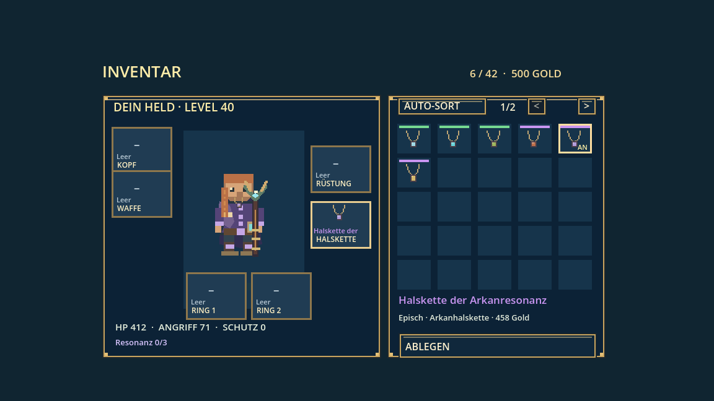

# Arkanhalsketten

Stand: 8. Oktober 2026. Lokal umgesetzt, noch nicht veröffentlicht.

Sechs Halsketten, alle für jede Klasse tragbar. Eigener Halskettenplatz mit
ANLEGEN / ABLEGEN / WECHSELN. Keine Grundwerte, keine Verbrauchsfunktion,
keine Fähigkeitsfreischaltung, keine Ränge.

- Frost: 20 % Verlangsamung für 2 s, alle 6 s. Bei Klassenbossen 10 %.
- Gewitter: 25 % eines normalen Angriffs als zusätzlicher Blitzschaden, alle 5 s.
- Giftdorn: 40 % eines normalen Angriffs über 4 s, alle 6 s.
- Kriegsherr: bis 5 Zorn, je 2 % bedingter direkter Schaden. Verfall nach 5 s ohne Treffer.
- Arkanresonanz: jede dritte angenommene Schadens-/Heilfähigkeit verstärkt ihre
  Leistung um 20 % und erstattet 20 % ihrer Kosten. Reine Schutz-/Bufffähigkeiten
  zählen nicht. Fusionen zählen als eine Anwendung.
- Jagd: drei direkte Treffer auf dasselbe Ziel innerhalb von 6 s ergeben einen
  Zusatztreffer mit 50 % eines normalen Angriffs.

Die drei Klassenbosse lassen je eine besondere Halskette als zusätzliche,
klassenübergreifende Beute fallen. Bestehende Waffen, Hüte und Relikte bleiben.
Pip verkauft normale Halsketten in seinem bestehenden Händlerzyklus.

Alte elementare Kerne und gespeicherte Angebote werden umgewandelt. UID,
Sperrmarkierung und Anzahl bleiben erhalten. Bereits gelernte Blitzlanze bleibt.
Der alte Arkankern als Questwaffe heißt Arkanhüter-Waffe und behält seine Werte.

Abklingzeiten bleiben bei einem Wechsel erhalten; Aufladungen werden gelöscht.
Eine laufende Frost-/Giftwirkung endet beim Ablegen der passenden Halskette.
Zusatz- und periodische Treffer lösen keine Halsketteneffekte aus.
Speichern/Laden und Server-Save-Prüfung unterstützen den neuen Ausrüstungsplatz.
Im Koop berechnet der Host die Trefferwirkungen und überträgt die sichtbare
Kette sowie Zorn-/Jagdfortschritt an den Träger. Die bestehende Konflux-PvP-
Kampflogik verwendet weiterhin ihre eigenen ausgeglichenen Kampfwerte.

## Prüfung

- `tools/check_arcane_necklaces.gd`: alle Klassen, sechs Effekte, keine Grundboni,
  Umwandlung, Laden, echte Heilfähigkeiten, Cooldowns, Duplikatwechsel,
  abgeschaltete Restwirkungen, isolierte Angreifer und garantierte Bossdrops.
- `tools/check_arcane_necklaces_network.gd`: echte WebSocket-Verbindung mit Host
  und zwei Clients; Wirkungen, Fortschritt, sichtbare Ausrüstung und Serverdrops.
- Bestehende Inventar-, Händler-, Skill-, Server-Save-, Kampf- und Dorfprüfungen.
- `tools/capture_arcane_necklaces.gd`: tatsächliche Inventardarstellung.

