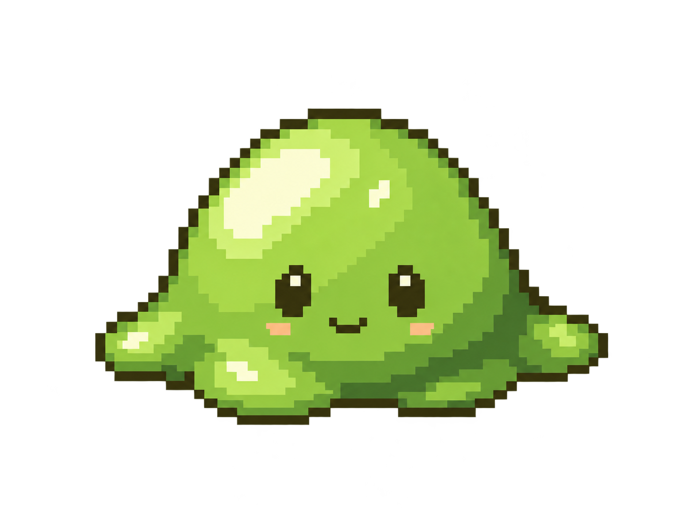

# Waldschleim – einfacher grüner Glibber

Aktiver Designauftrag. Die anderen 26 Monsterentwürfe bleiben für spätere Arbeit
archiviert. Dieser Entwurf ersetzt die dekorierte Gestaltungsrichtung des
Waldschleims, ohne die ursprünglichen Designtafeln zu überschreiben.

## Verbindliche Identität

- Unser einfachster, einfältigster Mob und der erste Gegner des Spielers.
- Kleiner grüner, glibbriger Slime: gedrungene runde Kuppel, breite weiche Basis
  und wenige unregelmäßige Glibberlappen.
- Etwas größere dunkle Augen mit Glanzpixeln, ein kleines freundliches Lächeln
  und dezente warme Wangenpixel. Der Ausdruck bleibt naiv und unkompliziert.
- Keine Blätter, Blüten, Moosbüschel, Ausrüstung, Waffen oder anderen Anhänger.
- Glibber durch klare Glanzpixel und wenige Grünabstufungen darstellen.
- Warme apfel-/blattgrüne Hauptfarbe, olivbraune Kontur, gelbgrüner Glanz.
- Harte quadratische Pixel, orthografische RPG-Draufsicht mit sichtbarer Front.
- Transparenter PNG-Hintergrund ohne Randhalo oder weichen Bodenschatten.

## Maßstab und Animation

Körperziel: etwa 40 × 32 Weltpixel gegenüber einem 64 Pixel hohen Charakter.
Vorgeschlagener Produktionsframe: 64 × 64 Pixel, Fußanker (32,52). Der sichtbare
Körper und seine Lappen sollen genügend Abstand zum Framerand behalten.
Das generierte PNG ist zunächst die visuelle Entwurfsreferenz, kein fertiger
Richtungs- oder Animationsatlas.

- Idle: langsames leichtes Zusammenfallen und Wiederaufrichten.
- Bewegung: kurzer Glibberhüpfer mit deutlicher flacher Landung.
- Einziger einfacher Angriff: sichtbar zusammendrücken, kurzer Körperstoß,
  danach langsame Erholung. Kein Gift, Fernangriff oder Zauber als Grundangriff.
- Treffer: kurzer seitlicher Glibberknick; Fußanker bleibt stabil.
- Tod: klein und flach zusammensacken; keine aufwendige Explosion.
- Acht echte Richtungen. Gesicht in Rückansichten vollständig verdecken;
  Seitenansichten zeigen höchstens den passenden Rand des Gesichts.
- Trefferzeit und Kollisionskörper bleiben von dekorativen Glibberpixeln getrennt.

## Referenz

[Vorheriger neutraler Entwurf](waldschleim-v2-front.png) bleibt als ältere Variante erhalten.

Die bisherigen Kampfwerte und die Live-Grafik bleiben während der Designarbeit
unverändert. Nächster Schritt: Grundform abstimmen, dann Richtungssatz und
Animationsframes aus derselben Identität entwickeln.
